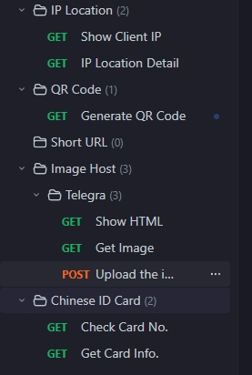

#  Little Helper


Little Helper for Cloudflare Workers, providing many util components in this single library. Powered on [Hono Framework](https://hono.dev/).

Chinese Documents 中文文档 👉 [Here](README_zh.md).

API Documents at [little-helper-api-doc.ajaxjs.com](https://little-helper-api-doc.ajaxjs.com/). U can view the document for each module in this doucments by clicking the moudle name. The version for Chinese is on the road.

---

# ⭐ Features
In a set of code, provide the following API interfaces:
|||
|---|----|
|||


# 🏗️ Deployment
## ⚡ Fast way

## 🪧 For developers to install
If u r a developer, u want to code it, then u should install all environments. It's a project of standard NodeJS, so u just install the dependences by:

```
npm install
```
And then run it:

    npm run dev

Beware of the version for NodeJS, I'm using v20.13.1. Plus this is a project of [Cloudflare Wrangler](https://developers.cloudflare.com/workers/wrangler/).
```
npm run deploy
```

# 🚗 Roadmap
- More and more utils to come.
- Make adapt to other factory like: Vercel Edge, Netlify, AWS Lambda.
- Analytics enhancements for all features by [Workers Analytics Engine](https://developers.cloudflare.com/analytics/analytics-engine).